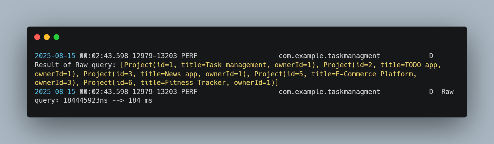

|            | Time (msec) | Note                                                                                                  | Screenshots                               |
| ---------- | ----------- | ----------------------------------------------------------------------------------------------------- | ----------------------------------------- |
| Room Query | 168 ms      | It's faster and easier in coding but the difference isn't significant maybe because the data is small |  |
| Raw Query  | 184 ms      | It's slower than Room query but varies maybe because the data is small but most of time slower        |    |
